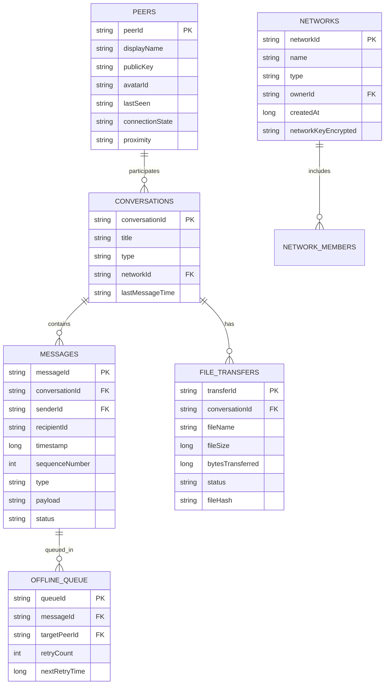

# Neara: Architecture & Specification Document

> Production-quality, Internet-independent local communication application built with Kotlin.

---

## 1. System Architecture Overview

Neara is engineered on **Clean Architecture** and **Domain-Driven Design (DDD)** principles to guarantee complete decoupling between networking transports, platform hardware APIs, cryptographic security, and the presentation layer.

```mermaid
graph TD
    UI[Compose Multiplatform UI Layer<br/>Nearby | Chats | Networks | Files | Profile] --> VM[ViewModels & Presentation State]
    VM --> Domain[Domain & Application Services<br/>ChatService | DiscoveryService | NetworkManager | FileTransferService | VoiceService]
    
    Domain --> Sec[Security & Cryptography Engine<br/>Ed25519 Identity | X25519 ECDH | ChaCha20-Poly1305 | HKDF]
    Domain --> Mesh[Mesh Routing Engine<br/>Multi-hop Routing | Loop Prevention | Route Discovery | TTL]
    Domain --> Storage[Persistence & Offline Queue<br/>SQLite Storage | OfflineQueueManager | MessageRepository]
    
    Domain --> Abstractions[Unified Abstraction Layer<br/>DiscoveryProvider | TransportProvider | ConnectionManager]
    
    Abstractions --> ImplLan[LAN / Wi-Fi Provider<br/>Multicast UDP / mDNS / TCP Sockets]
    Abstractions --> ImplP2P[P2P / Wi-Fi Direct Provider<br/>Wi-Fi Direct / Local Hotspot]
    Abstractions --> ImplBle[BLE Provider<br/>GATT Discovery / Peripheral Beacon]
```

---

## 2. Technology Stack

| Component | Selected Technology | Technical Rationale |
| :--- | :--- | :--- |
| **Language & Runtime** | **Kotlin 2.0+ (JVM 21 / KMP)** | Type safety, coroutines for non-blocking I/O, multiplatform code sharing between Windows and Android. |
| **UI Framework** | **Compose Multiplatform (Desktop)** | Modern, declarative, hardware-accelerated UI with fluid animations, dark mode, and shared UI components with Android Jetpack Compose. |
| **Concurrency** | **Kotlin Coroutines & Flow** | Structured concurrency for handling hundreds of concurrent peer sockets, streaming voice packets, and state updates. |
| **Serialization** | **kotlinx.serialization (Binary & JSON)** | High-performance serialization for wire protocols and structured payloads without reflection overhead. |
| **Cryptography** | **BouncyCastle / JCA (Java Cryptography Architecture)** | Industrial-grade cryptographic primitives: Ed25519 for digital signatures/identity, X25519 for ECDH key agreement, ChaCha20-Poly1305 for AEAD message encryption, and HKDF (RFC 5869) for key derivation. |
| **Database & Persistence** | **SQLite (via Exposed / SQLDelight)** | Zero-configuration, zero-dependency embedded database for offline-first message and peer persistence. |
| **Voice & Audio** | **Java Sound API (`javax.sound.sampled`) + Speex/Opus/PCM** | Low-latency audio line capture and playback on Desktop; abstract audio recorder/player interface for Android OpenSL/AudioRecord. |
| **Networking** | **Java NIO (Non-blocking I/O Channels)** | Scalable `SocketChannel`, `ServerSocketChannel`, and `DatagramChannel` for TCP framed messaging and UDP multicast discovery. |
| **Testing** | **JUnit 5, MockK, Coroutines Test** | Comprehensive automated testing of state machines, encryption, protocol frames, and mock peer mesh topologies. |

---

## 3. Platform Limitations & Networking Comparison

| Transport Technology | Primary Use | Advantages | Limitations & Platform Realities | Windows Support | Android Support | Battery / Background | Range & Bandwidth |
| :--- | :--- | :--- | :--- | :--- | :--- | :--- | :--- |
| **Wi-Fi LAN (UDP Multicast & Broadcast)** | Peer & Service Discovery | Zero configuration, works automatically on any shared Wi-Fi / Hotspot. | Some enterprise routers block multicast/broadcast (AP isolation). | **Native & Robust** via `DatagramSocket`. | **Supported**, requires `WifiManager.MulticastLock`. | Low battery impact; background discovery throttled on Android Doze. | Entire LAN subnet; broadcast is lightweight. |
| **TCP Framed Sockets** | Reliable 1-to-1 Chat, Group Sync, File Transfer | Reliable byte streams, flow control, congestion handling. | Requires IP connectivity between peers. | **Fully Supported** via NIO `SocketChannel`. | **Fully Supported**. | Moderate battery during active transfer; minimal when idle with keep-alives. | LAN speed (100 Mbps – 1 Gbps). |
| **UDP Datagrams** | Push-to-Talk Voice, Real-time audio | Ultra-low latency, no head-of-line blocking. | Unreliable delivery (packets may drop or arrive out of order). | **Fully Supported** via `DatagramChannel`. | **Fully Supported**. | Moderate during continuous voice streaming. | Sub-50ms latency on local networks. |
| **Wi-Fi Direct (P2P)** | True off-grid device-to-device high speed | No router/access point required; creates autonomous group. | Windows Wi-Fi Direct APIs require UWP/WinRT and are notoriously fragile across hardware; Android requires Wi-Fi P2P permissions and user consent dialogs. | **Limited / Driver dependent** (Fallback to Hotspot mode). | **Supported** via `WifiP2pManager`. | High battery usage during group negotiation. | 30–100 meters; 50–250 Mbps. |
| **Local Hotspot Mode** | Fallback when no Wi-Fi router is available | One device creates a local hotspot; others join. All standard TCP/UDP transports then work natively. | Requires one user to turn on hotspot; other devices must connect to that SSID. | **Supported** (Hosted Network / Mobile Hotspot). | **Supported** (Local-only Hotspot API `startLocalOnlyHotspot`). | High battery on hotspot host. | 50–100 meters; 50–300 Mbps. |
| **Bluetooth Low Energy (BLE)** | Zero-connection beacon discovery | Operates without Wi-Fi; minimal power. | Very small packet payload (advertising packet max 31 bytes or 255 bytes BLE 5.0); low throughput. | **Driver-specific WinRT**; background BLE advertising restricted on Windows without peripheral role hardware. | **Supported** (Peripheral & Central roles). | Extremely low battery. | 10–30 meters; advertising payload < 255 bytes. |

### Architectural Fallback Strategy
1. **Primary Transport**: Wi-Fi LAN / Hotspot using UDP Multicast Discovery + TCP Framed Connections + UDP Voice.
2. **Off-Grid Hotspot Auto-Guide**: If no local network is detected, the app offers "Create Local Network" (launches local hotspot) or "Join Local Network" (displays QR code with SSID/password).
3. **Transport Agnostic Abstraction**: The core messaging and routing layers operate solely over abstract `PeerConnection` channels, unaware of whether underlying bytes travel over Wi-Fi, Ethernet, Hotspot, or P2P.

---

## 4. Unified Abstraction Layer Design

```kotlin
// Discovery Abstraction
interface DiscoveryProvider {
    val transportType: TransportType
    fun startDiscovery(): Flow<DiscoveryEvent>
    fun stopDiscovery()
    fun broadcastPresence(metadata: DiscoveryMetadata)
}

// Connection & Transport Abstraction
interface TransportProvider {
    val transportType: TransportType
    suspend fun startServer(port: Int): Flow<PeerConnection>
    suspend fun connect(peer: Peer): PeerConnection
}

interface PeerConnection {
    val peerId: String
    val isConnected: Boolean
    suspend fun sendFrame(frame: ProtocolFrame): Boolean
    fun receiveFrames(): Flow<ProtocolFrame>
    suspend fun close()
}

// Subsystem Managers
interface PeerManager {
    val peers: StateFlow<List<Peer>>
    fun getPeer(peerId: String): Peer?
    fun updatePeerState(peerId: String, state: ConnectionState)
}

interface EncryptionManager {
    val localIdentity: DeviceIdentity
    fun encryptPayload(recipientPublicKey: ByteArray, plaintext: ByteArray): EncryptedPayload
    fun decryptPayload(senderPublicKey: ByteArray, encrypted: EncryptedPayload): ByteArray
    fun sign(data: ByteArray): ByteArray
    fun verify(publicKey: ByteArray, data: ByteArray, signature: ByteArray): Boolean
}

interface MessageTransport {
    suspend fun sendMessage(message: ChatMessage): MessageDeliveryResult
    fun observeIncomingMessages(): Flow<ChatMessage>
}

interface FileTransport {
    suspend fun sendFile(peerId: String, file: FileMetadata, fileStream: InputStream): Flow<TransferProgress>
    fun observeIncomingFiles(): Flow<IncomingFileTransfer>
}

interface VoiceTransport {
    suspend fun startPushToTalk(targetId: String, isGroup: Boolean)
    suspend fun stopPushToTalk()
    fun observeIncomingAudio(): Flow<AudioPacket>
}

interface MeshRouter {
    suspend fun routePacket(packet: MeshPacket): RoutingResult
    fun updateRoutingTable(peerId: String, nextHop: String, cost: Int)
}
```

---

## 5. Security & Cryptographic Architecture

### Cryptographic Primitives
- **Identity & Long-term Keys**: Each device generates an **Ed25519** keypair upon first launch. The public key is the cryptographic anchor of the user's identity.
- **Ephemeral Key Agreement**: For every 1-to-1 session, peers execute an **X25519 ECDH** handshake.
- **Key Derivation (HKDF)**: Master shared secret is derived into distinct symmetric keys:
  - `K_send` and `K_recv` (Directional symmetric keys)
  - `IV_base` (Base nonce)
- **Authenticated Encryption**: **ChaCha20-Poly1305** (or **AES-256-GCM**) with unique 96-bit monotonically increasing nonces to prevent replay attacks and eavesdropping.
- **Group & Network Encryption**: Each private network possesses a 256-bit `NetworkMasterKey` distributed to approved members via encrypted 1-to-1 sessions during the join handshake.

### Privacy Controls
- **Ephemeral Peer Identifiers**: Discovered peers advertise a rotating `tempDeviceId` linked to their public key.
- **Visibility Modes**:
  - `Visible`: Responds to discovery probes and broadcasts presence beacons.
  - `Invisible`: Silent mode. Listens for incoming connections from authorized peers without broadcasting presence.
- **Location Privacy**:
  - `Location OFF`: No coordinate payload.
  - `Approximate Location`: Rounded coordinate hash (fuzzed to ~500m radius).
  - `Exact Location`: Transmitted only when explicitly shared in chat.

### QR Code Authentication
QR codes contain only:
`neara://join?netId=<UUID>&name=<Base64>&pubKey=<Base64>&rendezvousPort=<Port>`
**No passwords or master keys are encoded inside the QR code.** The QR code acts as an out-of-band trust anchor to authenticate the host's public key during the subsequent encrypted handshake.

---

## 6. Binary Wire Protocol Specification

All messages are framed using a lightweight, endian-safe binary header:

```
+--------------------+-------------------+--------------------+--------------------+
| Magic (4 bytes)    | Version (1 byte)  | Packet Type (1 byte| Payload Len (4 B)  |
| 0x4E 0x45 0x41 0x52| 0x01              | 0x01..0xFF         | Big-Endian Int32   |
+--------------------+-------------------+--------------------+--------------------+
| IV / Nonce (12 B)  | Sender PubKey Hash| Payload Data (Encrypted)                |
|                    | (8 bytes)         | (Variable Length)                       |
+--------------------+-------------------+--------------------+--------------------+
| Authentication Tag / Signature (16 or 64 bytes)                                  |
+----------------------------------------------------------------------------------+
```

### Packet Types
- `0x01` `DISCOVERY_BEACON` (UDP Multicast presence)
- `0x02` `DISCOVERY_QUERY` (Direct discovery probe)
- `0x03` `KEY_EXCHANGE_INIT` (X25519 ephemeral key share)
- `0x04` `KEY_EXCHANGE_RESP` (X25519 response + signature)
- `0x10` `CHAT_MESSAGE` (Encrypted text, emojis, replies)
- `0x11` `MESSAGE_ACK` (Delivered / Read status)
- `0x20` `FILE_OFFER` (File metadata, size, sha256)
- `0x21` `FILE_ACCEPT` / `FILE_REJECT` (Resume offset)
- `0x22` `FILE_CHUNK` (Chunk index, data slice, chunk hash)
- `0x30` `VOICE_STREAM_START` (PTT stream initiation)
- `0x31` `VOICE_PACKET` (Opus/PCM encoded audio frame)
- `0x32` `VOICE_STREAM_END` (PTT stream termination)
- `0x40` `NETWORK_JOIN_REQUEST` (Public key + signature)
- `0x41` `NETWORK_JOIN_RESPONSE` (Approval status + encrypted network key)
- `0x50` `MESH_FORWARD_PACKET` (Encrypted payload with routing header)

---

## 7. Database & Local Storage Design

SQLite tables managed through clean DAOs:

### Schema Diagram



### Message Lifecycle State Machine
```
[User Drafts Message]
          │
          ▼
      [Pending]  ──(Peer Online)──► [Sending] ──(Socket Write)──► [Sent]
          │                                                         │
    (Peer Offline)                                             (Peer ACK)
          │                                                         │
          ▼                                                         ▼
   [Offline Queue] ──(Peer Reconnected)──► [Sending]           [Delivered]
                                                                    │
                                                               (Read Receipt)
                                                                    │
                                                                    ▼
                                                                  [Read]
```

---

## 8. Mesh Routing Architecture

For scenarios where direct peer connectivity is missing ($A \to B \to C \to D$):


### Mesh Routing Rules & Protections:
1. **End-to-End Encryption**: The payload is encrypted with Peer D's public key. Relays B and C **cannot decrypt or tamper with the payload**.
2. **Loop Prevention & TTL**: Every mesh frame has a `TTL` (Time To Live, default 5 hops) decremented at each hop. If $TTL \le 0$, packet is dropped.
3. **Duplicate Packet Suppression**: Each node keeps a sliding-window Bloom filter / LRU cache of `(sourceId, messageId)`. Already-seen packets are silently discarded to prevent broadcast storms.
4. **Trusted Relay Policy**: Users can configure relay behavior (`Relay for Everyone`, `Relay for Known Networks Only`, `Relay Disabled`).

---

## 9. UI Screen Map & Flow

```
[Main Application Window]
  ├── Bottom Navigation Bar / Sidebar
  │     ├── 🟢 Nearby Screen
  │     │     ├── Status Header: "Local mode active" (IP, Subnet, Port)
  │     │     ├── Visibility Toggle: [Visible | Invisible]
  │     │     ├── Discovered Nearby Devices (Cards with Avatar, Name, Ping, Connect button)
  │     │     └── Nearby Public Networks (Join button, Network status)
  │     │
  │     ├── 💬 Chats Screen
  │     │     ├── Conversations List (1-to-1 & Group, unread badges)
  │     │     ├── Offline Queue Warning indicator ("2 messages queued for offline peers")
  │     │     └── Active Chat View:
  │     │           ├── Chat Header (Peer name, connection status, PTT call button)
  │     │           ├── Message Bubbles (Delivered ✓, Read ✓✓, Pending ⏱)
  │     │           ├── Push-to-Talk Bar (Hold to talk, live waveform)
  │     │           └── Input Area (Text, Emoji, Attach File, Send)
  │     │
  │     ├── 🌐 Networks Screen
  │     │     ├── "Create Network" (Public or Private with Password/PIN)
  │     │     ├── Active Networks List
  │     │     └── Network Details (Members, Admins, QR Invitation Modal, Leave)
  │     │
  │     ├── 📁 Files Screen
  │     │     ├── Active Transfers (Progress bar, Transfer rate MB/s, Pause/Resume)
  │     │     └── Transfer History (Received files with "Open Folder" button)
  │     │
  │     └── ⚙️ Profile & Settings Screen
  │           ├── User Display Name & Custom Avatar
  │           ├── Cryptographic Identity Fingerprint (Ed25519 Public Key)
  │           ├── Privacy Settings (Location: Off/Approximate/Exact)
  │           └── Transport Settings (Select network interfaces, ports)
```

---

## 10. Development Implementation Phases

- **Phase 1: Project Foundation & Core Domain Models**
  - Setup Gradle multi-module / clean structure with Kotlin 2.0 and Compose Multiplatform.
  - Implement Core Domain Models (`Peer`, `ChatMessage`, `Network`, `ProtocolFrame`).
  - Implement Cryptography Engine (`Ed25519`, `X25519`, `ChaCha20Poly1305`, `HKDF`).
  - Unit tests for Crypto, Serialization, and Framing.

- **Phase 2: Discovery Subsystem**
  - Implement UDP Multicast/Broadcast `DiscoveryProvider`.
  - Implement `PeerRepository` and `PeerStateManager` with timeouts, heartbeat, and presence events (`PeerFound`, `PeerUpdated`, `PeerLost`).
  - Unit and integration tests for discovery.

- **Phase 3: Reliable Transport & Local-First Messaging**
  - Implement TCP `TransportProvider` with framed binary protocol.
  - Implement `ChatService`, `MessageRepository`, `OfflineQueueManager`, and delivery acknowledgements.
  - Test offline queueing, disconnection, and auto-retry on reconnection.

- **Phase 4: Public & Private Network Management**
  - Implement Network Join Protocol, QR Code generation/parsing, and PIN verification.
  - Admin controls (member approval, kick, leave).

- **Phase 5: File Transfer & Push-To-Talk Voice**
  - Implement chunked file transfer with SHA-256 integrity and resume capability.
  - Implement UDP voice streamer with push-to-talk state machine and Java Sound audio engine.

- **Phase 6: Mesh Routing Layer**
  - Implement multi-hop packet forwarding, route discovery, loop prevention, and duplicate suppression.

- **Phase 7: Modern Compose Multiplatform UI**
  - Build the sleek dark-mode desktop UI with live Nearby Radar, active chat bubbles, PTT button, network management, and file transfer monitors.
